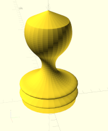

+++
title = "3D-Zeichnen mit OpenSCAD, Teil 1/3: das 2D-Subsystem"
date = "2024-07-08"
categories = ["ChaosSeminar"]

[ChaosSeminar]
Thema = ""
Termin = "2024-07-08 19:00 (Einlass 18:30)"
Ort = "Universität Ulm, o27, 3. Stock, Raum 341"
Vortragende = "Marcus"
Archiv = []
+++



Inhalt:

Wir beschäftigen uns mit den Zeichenprimitiven Rechteck und Kreis.
Mit ein paar OpenSCAD-Funktionen werden daraus beeindruckende aber
verstehbare Modelle.

Beispiele:

- Schachfiguren

  
  
   
  
- Spirelli-Nudeln

  
  
  
- Dampflok

  
  
- Wasserflaschen-Raketenfinne

  

