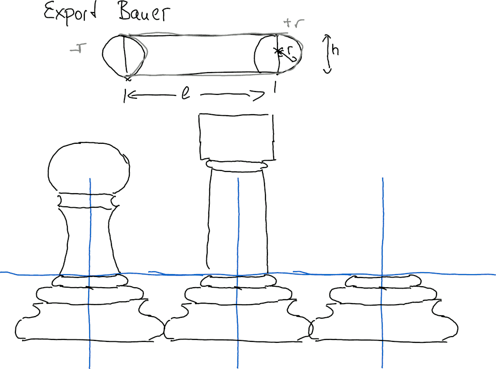
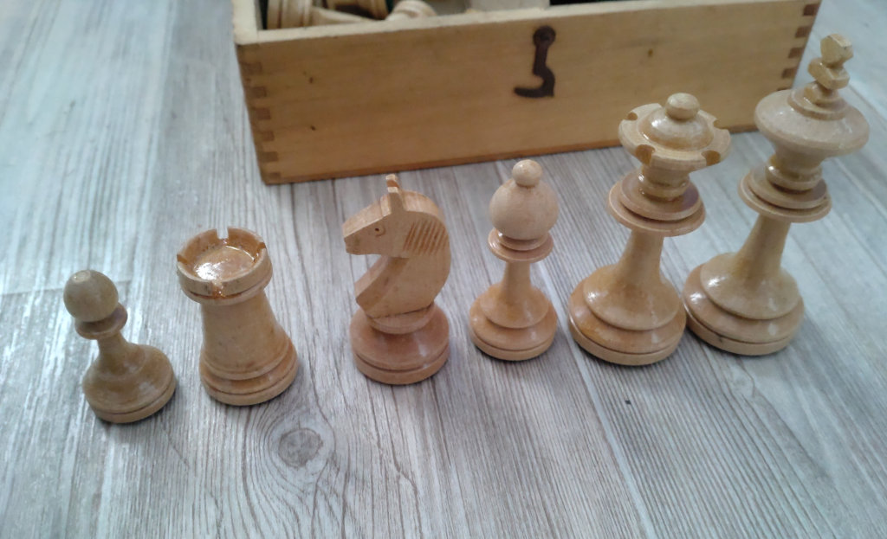
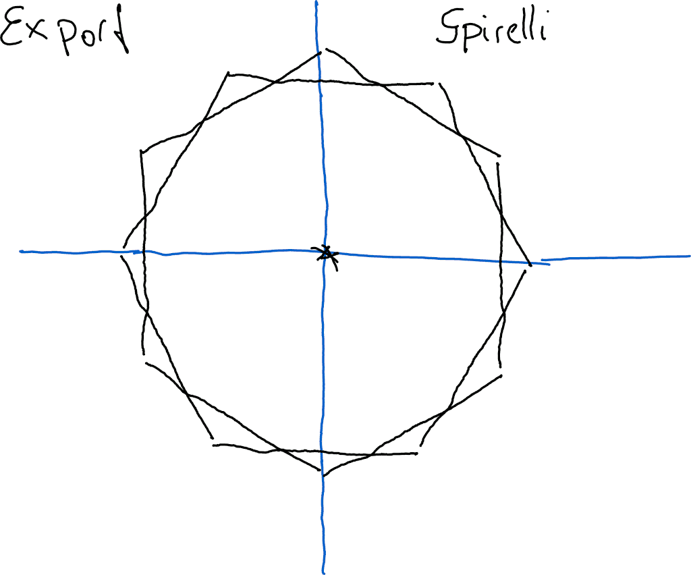
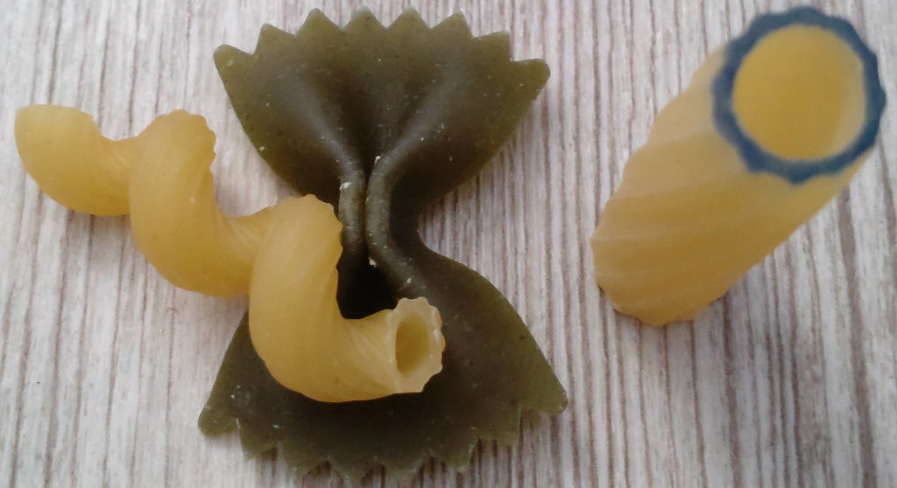
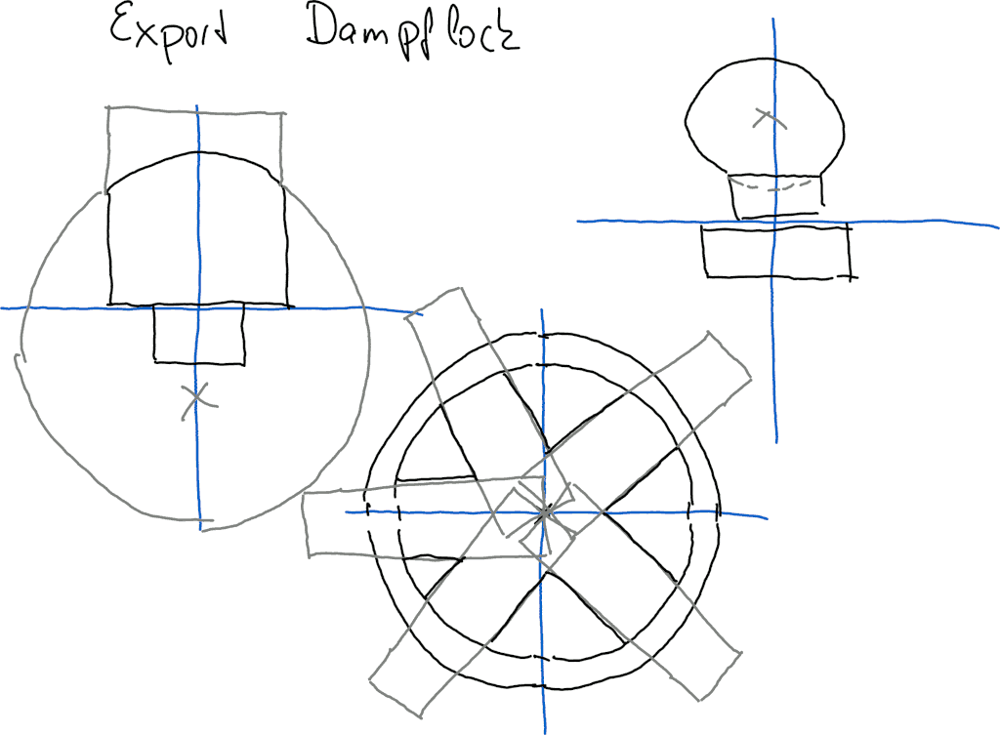
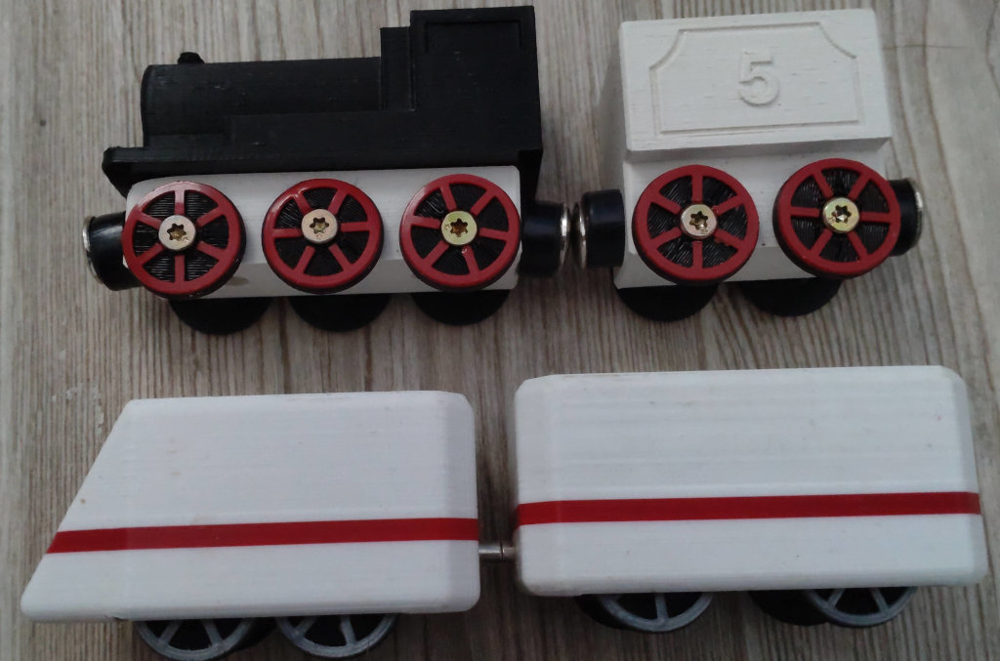
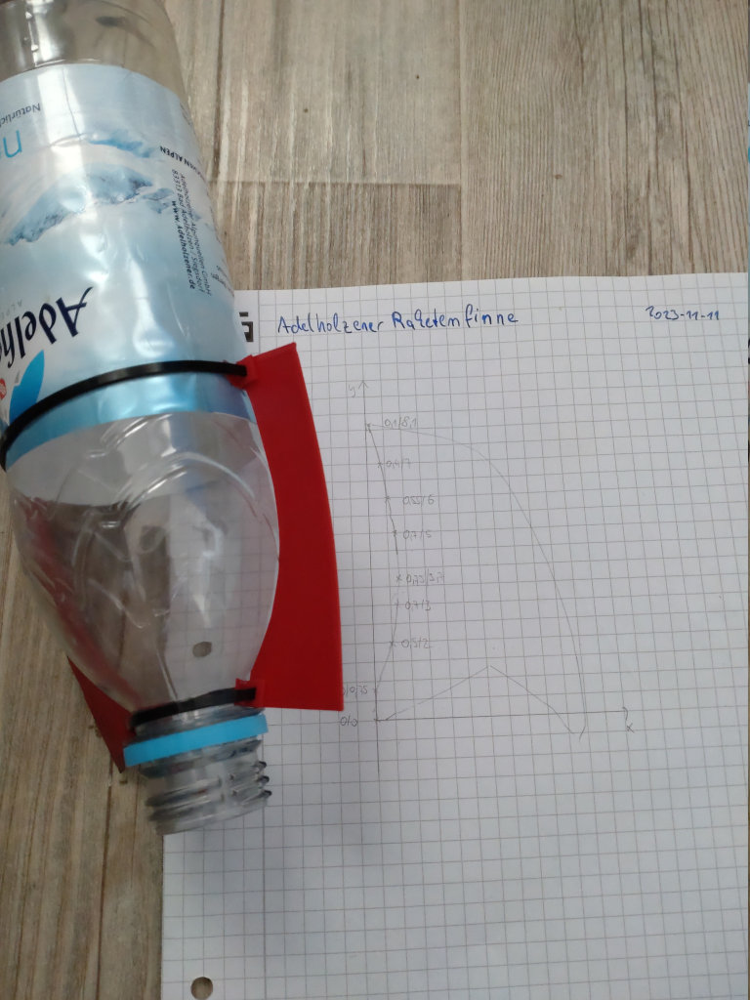

+++
title = "3D-Zeichnen mit OpenSCAD, Teil 1/3: das 2D-Subsystem"
date = "9999-01-01"
categories = ["ChaosSeminar"]

[ChaosSeminar]
Thema = ""
Termin = ""
Ort = "TBD"
Vortragende = "Marcus"
Archiv = []
+++



Inhalt:

Wir beschäftigen uns mit den Zeichenprimitiven Rechteck und Kreis.
Mit ein paar OpenSCAD-Funktionen werden daraus beeindruckende aber
verstehbare Modelle.

Beispiele:

- Schachfiguren
  
  
- Spirelli-Nudeln
  
  
- Dampflok
  
  
- Wasserflaschen-Raketenfinne
  

