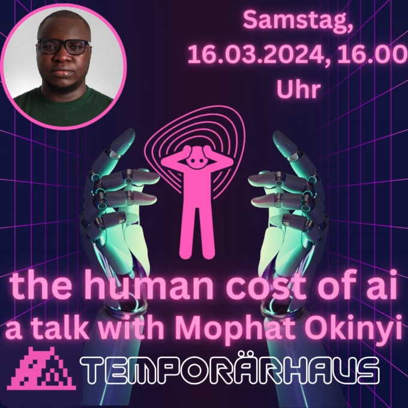

+++
author = "frdnd"
title = "Vortragsankündigung"
date = "2024-03-11"
categories = ["Log"]
hide_readingtime = true
+++

Constanze war so nett uns den Kontakt zu [Guido](https://icegorilla.com/) zu vermitteln. Im Rahmen der [cyberfestspiele](https://www.cyberfestspiele.net/) hat Guido den Kontakt zum KI und Menschenrechtsaktivist Mophat Okinyi hergestellt. Da uns das Thema KI am Herzen liegt
und man Technik nicht unabhängig von gesellschaftlichen Folgen betrachten kann, haben wir den Vortrag zusammen mit dem Temporaerhaus nach Ulm geholt. 

Der Vortrag findet am 16.03.2024 um 16:00h im Temporaerhaus (Augsburger Str. 23, 89231 Neu-Ulm) statt. Wir freuen uns über zahlreiches erscheinen!!

Und hier noch der offizielle Pressetext (via Guido):

**Mophat Okinyi, Gründer & CEO, Techworker Community Africa**

[Mophat Okinyi](https://www.linkedin.com/in/mophat-okinyi/) ist ein geschätzter Datentrainer, der sich auf maschinelles Lernen und KI spezialisiert hat und vom [Responsible AI Institute](https://www.linkedin.com/company/responsible-ai-institute/) als Gewinner des [RAISE 2023 Outstanding Individual Award](https://www.responsible.ai/post/responsible-ai-institute-hosts-annual-raise-event-charting-the-future-of-responsible-ai) ausgezeichnet wurde. Mophat Okinyi wurde für seine inspirierende Führungsrolle im Bereich der verantwortungsvollen KI durch Forschung, Lobbyarbeit, Politik und vertrauenswürdige Rahmenwerke ausgezeichnet.

Als KI- und Menschenrechtsaktivist setzt er sich in erster Linie für die faire Behandlung und die Rechte von Moderatoren von Online-Inhalten, Tech-Mitarbeitern und Datenschulungsexperten ein. Sein Hauptanliegen ist es, dafür zu sorgen, dass diese Personen in der KI-Entwicklung nicht in den Status von Wegwerfarbeitern im Backend gedrängt werden. Ihn treibt die Überzeugung an, dass jeder Arbeitnehmer es verdient, mit Respekt und Würde behandelt zu werden, und dass seine grundlegenden Menschenrechte gewahrt werden müssen. Um diese Vision zu verwirklichen, setzt er sich für ein Umfeld ein, in dem der technische und der KI-Fortschritt der gesamten Menschheit ohne Diskriminierung zugute kommt. Indem er sich für eine gerechte Behandlung und den Schutz der grundlegenden Menschenrechte einsetzt, will er eine Zukunft schaffen, in der Technologie allen Menschen zugute kommt, unabhängig von ihrer Rasse oder Hautfarbe.

Als Ausschussmitglied der African Content Moderators Union leitet Mophat Initiativen, die sich für die faire Behandlung afrikanischer Tech-Fachkräfte und Content-Moderatoren einsetzen. Seine Arbeit befasst sich mit den Herausforderungen der Arbeitsbedingungen und fördert die berufliche Entwicklung und spiegelt sein Engagement für die Rechte und das Wohlergehen afrikanischer Tech-Fachleute und Content-Moderatoren wider.

Gleichzeitig setzt sich Mophat als Gründer und CEO der Techworker Community Africa für die Schaffung einer florierenden Tech-Industrie in Afrika ein. Die Organisation befähigt, informiert und unterstützt Techworker, stellt sicher, dass ihre Rechte geschützt werden und fördert das Vertrauen und die Begeisterung, zum Wachstum der digitalen Wirtschaft beizutragen.

Zusätzlich zu seinen einflussreichen Rollen war Mophat an der Datengenerierung für maschinelles Lernen beteiligt. Er war maßgeblich an der Bereitstellung der Daten beteilig, die verwendet wurden, um Inhalte herauszufiltern, die in der Entwicklungsphase von ChatGPT als illegal oder schädlich angesehen wurden. Er wurde vom [Alan Turing Institute](https://www.turing.ac.uk/?utm_source=AIUKmicrosite&utm_medium=button&utm_campaign=aiuk23) als Redner auf der [AI UK 2024](https://ai-uk.turing.ac.uk/) gelistet, wo er über die kritische Schnittstelle von Daten, Arbeit und KI sprechen wird. Seine aufschlussreichen Beiträge zu diesem Thema wurden auch in prominenten globalen Medien wie dem Wall Street Journal, dem Times Magazine, dem Guardian, der BBC und anderen veröffentlicht.

Angetrieben von seinem Wunsch nach einer fairen Tech-Politik im Bereich der künstlichen Intelligenz hat Mophat zusammen mit drei Kollegen [eine Petition an das kenianische Parlament](https://twitter.com/MercyMutemi/status/1678984336996028416) gerichtet, um die Arbeitsbedingungen von Tech-Arbeitern in Kenia zu untersuchen. Dieser mutige Schritt unterstreicht sein Engagement für einen positiven Wandel in der Tech-Branche, indem er sich für die Rechte und das Wohlergehen von Tech-Fachkräften einsetzt.

Durch sein Engagement, seine Veröffentlichungen und seine Vorträge prägt Mophat weiterhin das Bild einer verantwortungsvollen KI und leistet einen wichtigen Beitrag zum globalen Dialog über die ethischen Implikationen der KI-Entwicklung und -Nutzung.

*dieser Text wurde maschinell übersetzt*

