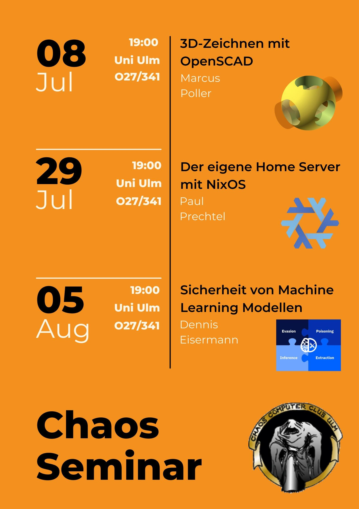

+++
author = "roland"
title = 'nächste Chaos-Seminare'
date = "2024-07-07"
categories = ["Log"]
hide_readingtime = true
+++

Die nächsten Chaos-Seminare sind geplant:

- 08.07.2024 [3D-Zeichnen mit OpenSCAD: 2D-Grundlagen, Erstellung von 3D-Modellen aus 2D](/ccc/chaosseminar/2024_07_openscad1/)  
  (siehe auch die 2 weiteren Blogposts)
- 29.07.2024 [NixOS: Der eigene Home Server mit NixOS](/ccc/chaosseminar/2024_07_nixos/)
- 05.08.2024 [Sicherheit von Machine Learning Modellen](/ccc/chaosseminar/2024_08_machine-learning/)

Wie immer sind die Vorträge öffentlich (jeder, der sich für das Thema
interessiert, ist herzlich eingeladen).

Flyer (darf gerne verteilt werden):

