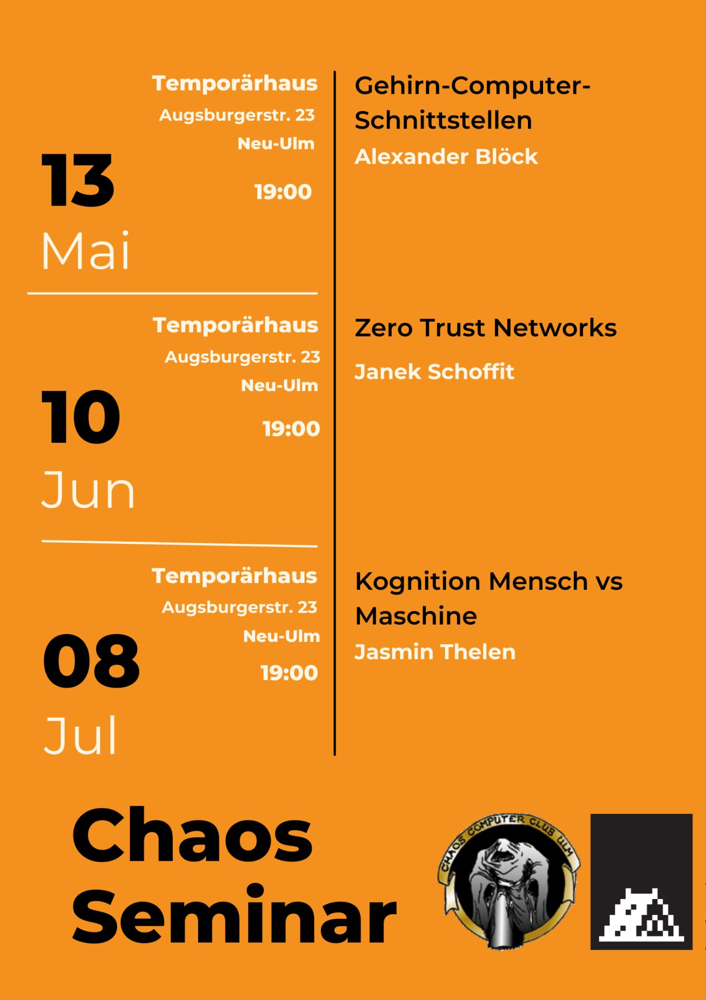

+++
author = "roland"
title = 'Chaos-Seminare Mai/Juni/Juli'
date = "2025-05-05"
categories = ["Log"]
hide_readingtime = true
+++

Die Chaos-Seminare für Mai bis Juli sind geplant:

- 13.05.2025 [Gehirn-Computer-Schnittstellen](/ccc/chaosseminar/2025_05_brain_computer_interfaces/)
- 10.06.2025 [Zero Trust Networks](/ccc/chaosseminar/2025_06_zero_trust_networks/)
- 08.07.2025 [Kognition Mensch vs Maschine](/ccc/chaosseminar/2025_07_koginition_mensch_vs_maschine/)

Die Chaos-Seminare finden im [Temporärhaus Neu-Ulm](/contact/index.html#temporärhaus-neu-ulm) statt.

Wie immer sind die Vorträge öffentlich (jeder, der sich für das Thema
interessiert, ist herzlich eingeladen).

Flyer (darf gerne verteilt werden):

